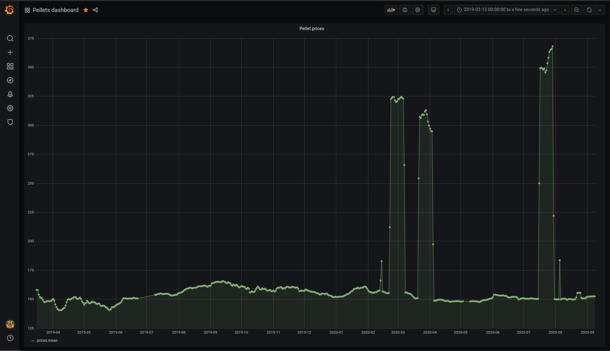

# Wood pellet price tracker on Grafana

Previously had made a project for crawling pellet prices [here](https://github.com/daviskregers/wood-pellet-price-tracker).
I wanted to do all sorts of improvements to it, but then realized that most of
them can be implemented by just switching to grafana.

## Setting up

1. Run `docker compose up`
2. Open up grafana and add a source that links to influxdb
    - By default its port 8086
    - database: pellets
    - username: admin
    - password: (empty)
3. Create a dashboard using the datasource (you can use the [this](https://github.com/daviskregers/wood-pellet-price-tracker-grafana/blob/master/grafana-model.json))

