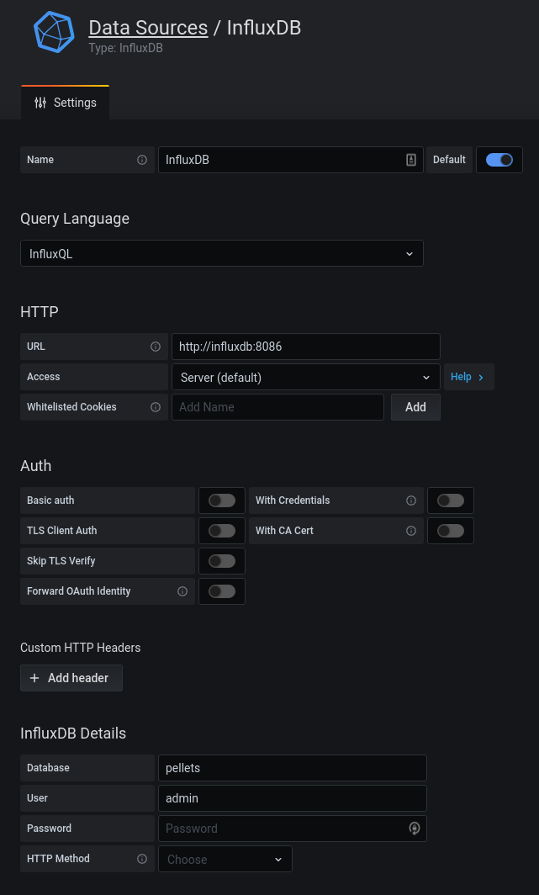
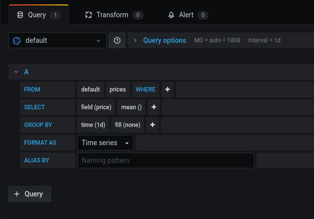

# Wood pellet price tracker on Grafana

Previously had made a project for crawling pellet prices here https://github.com/daviskregers/wood-pellet-price-tracker
I wanted to do all sorts of improvements to it, but then realized that most of them can be implemented by just switching to grafana.


## TODO:

- [x] Setup dockerized grafana and influxdb
- [x] Import historical data
- [ ] Setup crawler w/ influxdb

## Setting up grafana

Setup data source:



Create a new dashboard and panel setup query:



## Migrate data from old PostgreSQL

To migrate from postgresql to influxdb, run following:

```
sudo pacman -S postgresql python-influxdb
pip install psycopg2 python-dotenv
```

Setup the .env file:

```
cp .env.example
vim .env
```

Run the migration:
```
python migrate.py
```